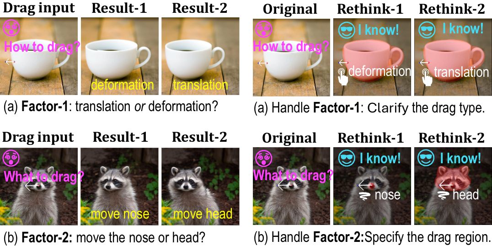
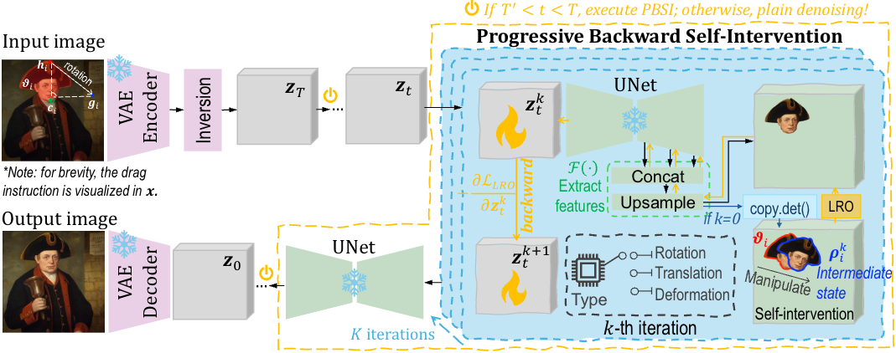

<p align="center">
  <h1 align="center">DragNeXt: Rethinking Drag-Based Image Editing</h1>
</p>

🌈 This repository is the official code of [DragNeXt](https://arxiv.org/pdf/2506.07611). DragNeXt is accepted by AAAI 2026 🎉🎉🎉!


## A. Two Ambiguity Issues: Factor-1 and Factor-2

<p align="center">
  
</p>

## B. Framework of DragNeXt

<p align="center">
  
</p>


## C. Environment Preparation

Run the command:
`pip install -r requirements.txt`

## D. Run DragNeXt Code
`cd DragNext && python dragnext_ui.py`

## 🎯 Todo list

- [X] open a Github repository for DragNeXt;
- [X] initialize README.md;
- [ ] add more visualized results in the repository;
- [X] upload the code of DragNeXt;
- [ ] re-clean and polish the code;
- [X] detail the packages and environment required by DragNeXt;

## 🌟 BibTeX

If you find this repository is useful for your research, please give us a star and cite our paper 🙏!

```bibtex
@article{zhou2025dragnext,
  title={DragNeXt: Rethinking Drag-Based Image Editing},
  author={Zhou, Yuan and Zhou, Junbao and Xu, Qingshan and Zhao, Kesen and Wang, Yuxuan and Fei, Hao and Hong, Richang and Zhang, Hanwang},
  journal={arXiv preprint arXiv:2506.07611},
  year={2025}
}
```
